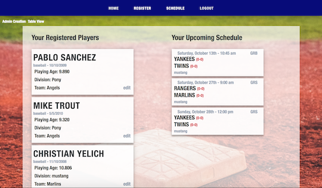
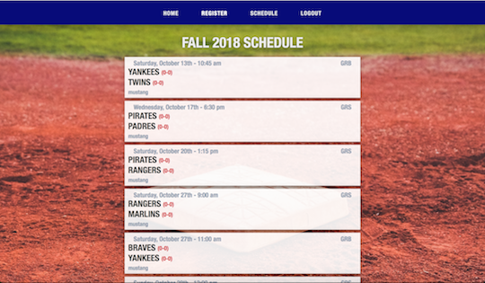

# Baseball Management

This is the front-end repo for a simple, minimal youth baseball management website. The site allows users to sign up and register themselves as a player and pay for their registration. It also allows an administrator to keep track of who has played, determine ages, contact parents, and more.

Live demo is [here](https://baseball-management-system.herokuapp.com/)

Back-end repo is [here](https://github.com/chagoy/baseball-management-system-server)

## Install

Clone this repo, `cd` into the project folder, run `npm install` in the terminal. 

## Login

To test the app you can login using `testuser` as the user and `password` as the password. `testuser` has administrative privileges and should see all players in the database. Normally a user can only see and view players they've registered.

## Technologies Used

* React
* Redux
* Redux Forms
* Stripe-React-Elements
* JWT Decode
* React Datepicker
* React Router Dom
* Font Awesome

## Stripe

This app uses stripe to handle payment processing. Right now the implementation is very simple with amounts being hard coded on the server side. 

## Screenshots

## Plans

* More store like appearance during registration
* Ability for user to toggle the amount of times to be charged (say they register 2 players)
* Admin view uploaded birth certificates on the front end, right now they appear on the Amazon server)
